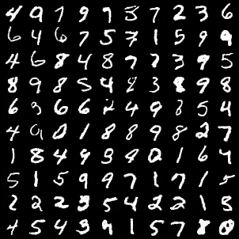

## Denosing Diffusion Probabilistic Models (DDPM) implement in Pytorch

This repository implements [DDPM](https://arxiv.org/abs/2006.11239) from scratch in Pytorch.

### Output Sample Example

 

### Quickstart

1. **Prepare the dataset**. This implement takes [MINST](https://yann.lecun.com/exdb/mnist/) as an example.

The dataset path looks like this:

```
./data/MNIST/
└── raw
   	├── t10k-images-idx3-ubyte
   	├── t10k-labels-idx1-ubyte
    ├── train-images-idx3-ubyte
   	└── train-labels-idx1-ubyte
```

The corresponding part in the config yaml file `./config/default.yaml` is as follow:

```
dataset_params:
  root_dir: 'data/MNIST/raw'
```


2. **Create the conda environment**

You can either run the following command:

```
pip install -r requirements.txt
```

or the following command:

```
conda env create -f environment.yaml
```

After creating the environment, run `conda activate ddpm-pytorch` to enter the environment.


3. **Training**

Enter the base directory ` DDPM-pytorch`. Run `python3 ./scripts/train.py` to conduct the training task. You can change the training relevant parameters in the file `./config/default.yaml`.

The training task (31 epochs) takes about 40 minutes on one `NVIDIA RTX 4090 24G`. The checkpoint file is [available](https://cloud.tsinghua.edu.cn/d/10d12a84cafc40e89f5a/) now.


4. **Inference**

For the inference task, you should first **set the checkpoint name** in `./config/default.yaml`. For example, if the config looks like this:

```
train_params:
  task_name: 'default'
  ckpt_name: 'model_31.pt'
```

Then the checkpoint path should be like:

```
/DDPM-pytorch/experiment/default/model_31.pt
```

Then, run `python3 ./scripts/inference.py` to conduct the inference task.


### Output

The output will be under the folder `./experiment/$(task_name)/samples` folder, containing all the $x_{t}$ at diffusion time step t (t is form 1 to num_timesteps). `$(task_name)` is the parameter defined in `./config/default.yaml`.


### Reference

1. The origin [code](https://github.com/hojonathanho/diffusion) of DDPM which is in TensorFlow.
2. https://github.com/explainingai-code/DDPM-Pytorch/tree/main

